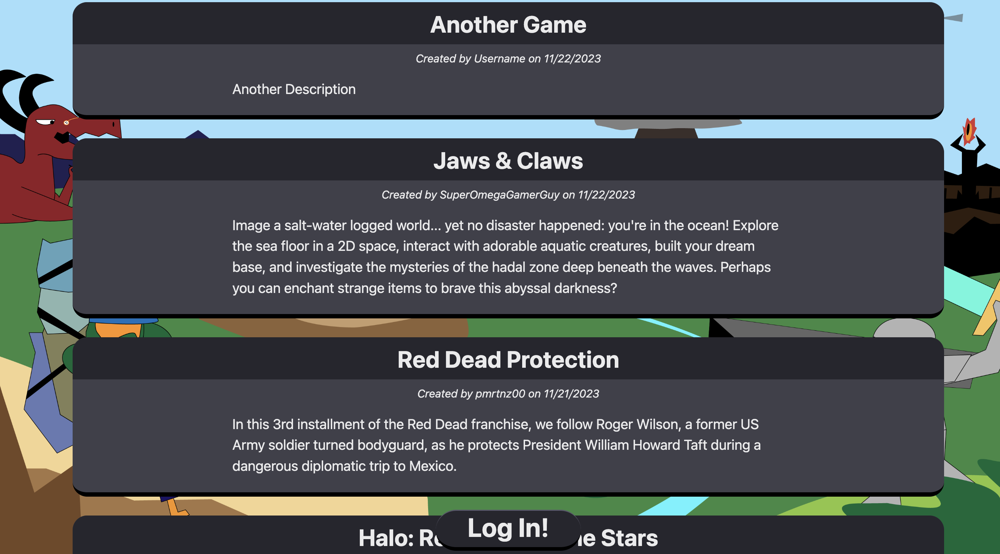
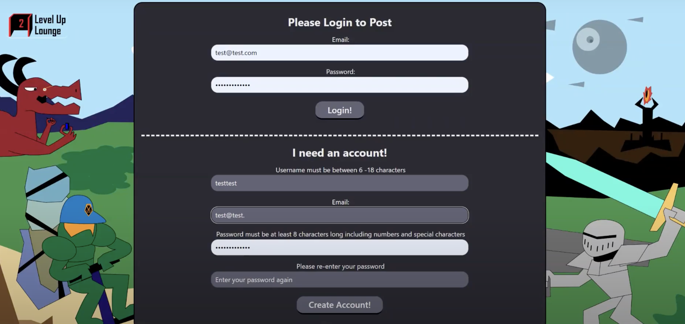
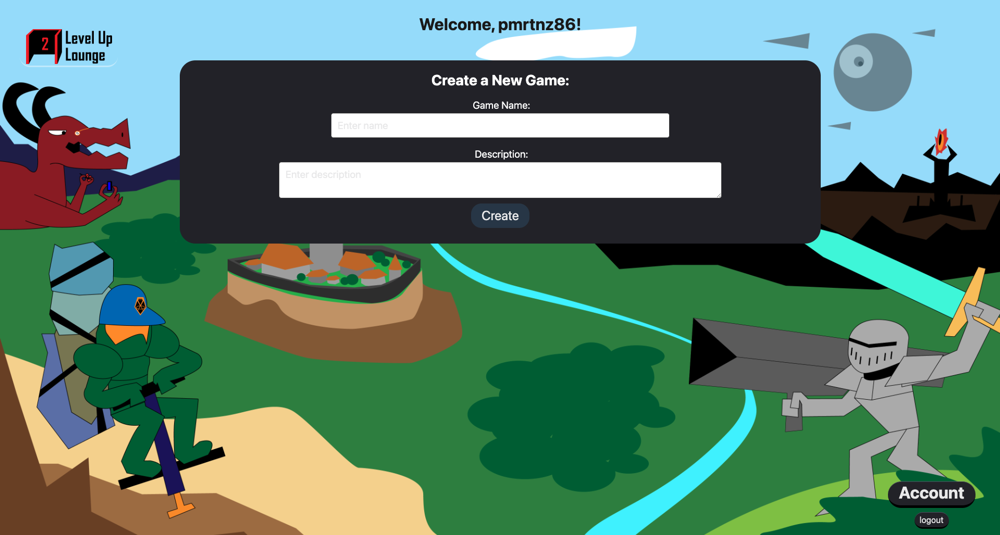
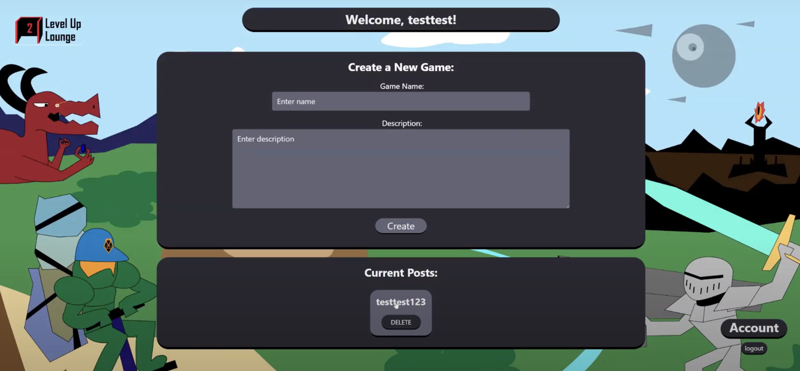

# Level Up Lounge

## Description
Level Up Lounge is a social media site for people, who love gaming, and wish to share their unique perspectives about future developments in games that they play.

## Table of Contents

- [Installation](#installation)
- [Usage](#usage)
- [Usage](#usage)
- [License](#license)
- [Contributions](#contributions)
- [Questions](#questions)

## Installation
The site requires a browser with internet connection to access. The site allows a user to view posts without signing in, but posting requires a valid e-mail address and password combination.

## Usage
Anyone with a browser may navigate to the site and view posts. The site requires a user be logged in to create post. There are plans to implement an upvote/downvote system in future developments, but those are not active on the site yet. 

Logged Out Viewing Homepage: 

Login or Signup: 

Create New Post: 

Post Created:

## License
Copyright (c) <2023> <copyright Peter Martinez, Steven Reed, Matthew Roberts, Kenneth Wong>

Permission is hereby granted, free of charge, to any person obtaining a copy
of this software and associated documentation files (the "Software"), to deal
in the Software without restriction, including without limitation the rights
to use, copy, modify, merge, publish, distribute, sublicense, and/or sell
copies of the Software, and to permit persons to whom the Software is
furnished to do so, subject to the following conditions:

The above copyright notice and this permission notice shall be included in all
copies or substantial portions of the Software.

THE SOFTWARE IS PROVIDED "AS IS", WITHOUT WARRANTY OF ANY KIND, EXPRESS OR
IMPLIED, INCLUDING BUT NOT LIMITED TO THE WARRANTIES OF MERCHANTABILITY,
FITNESS FOR A PARTICULAR PURPOSE AND NONINFRINGEMENT. IN NO EVENT SHALL THE
AUTHORS OR COPYRIGHT HOLDERS BE LIABLE FOR ANY CLAIM, DAMAGES OR OTHER
LIABILITY, WHETHER IN AN ACTION OF CONTRACT, TORT OR OTHERWISE, ARISING FROM,
OUT OF OR IN CONNECTION WITH THE SOFTWARE OR THE USE OR OTHER DEALINGS IN THE
SOFTWARE.

## Contributions
This project used the UC Berkeley mini-project-template as a base of starter code under the recommendation of our instructor Emmanuel Jucaban. All other code was written using primary documentation and referenced materials from our coursework.

## Questions
Please reach out to the developers via GitHub or email addresses provided below for contributions, or questions about this project, please reach out to the developers of Level Up Lounge on GitHub or via e-mail, 

Peter Martinez: 
https://github/reasonablep |

Steven Reed:
https://github/stevenreed |

Matthew Roberts:
https://github/Mattmrob |

Kenneth Wong:
https://github/kenwong356 |

Thanks for reading. 